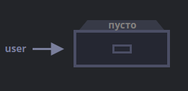
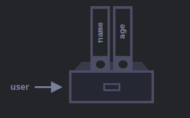
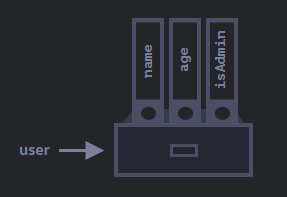
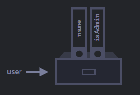
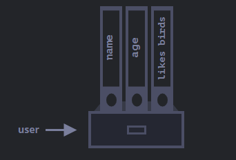

# Object


_Как мы знаем из главы [Типы данных](https://learn.javascript.ru/types), в JavaScript существует 8 типов данных. Семь из них называются «примитивными», так как содержат только одно значение (будь то строка, число или что-то другое)._

_Объекты же используются для хранения коллекций различных значений и более сложных сущностей. В JavaScript объекты используются очень часто, это одна из основ языка. Поэтому мы должны понять их, прежде чем углубляться куда-либо ещё._

_Объект может быть создан с помощью фигурных скобок `{…}` с необязательным списком свойств. Свойство – это пара «ключ: значение», где `ключ` – это строка (также называемая «именем свойства»), а `значение` может быть чем угодно._

_Мы можем представить объект в виде ящика с подписанными папками. Каждый элемент данных хранится в своей папке, на которой написан ключ. По ключу папку легко найти, удалить или добавить в неё что-либо._


Пустой объект («пустой ящик») можно создать, используя один из двух вариантов синтаксиса:

```js
let user = new Object(); // синтаксис "конструктор объекта"
let user = {};  // синтаксис "литерал объекта"
```


Обычно используют вариант с фигурными скобками `{...}`. Такое объявление называют _литералом объекта_ или _литеральной нотацией._

## Литералы и свойства
При использовании литерального синтаксиса `{...}` мы сразу можем поместить в объект несколько свойств в виде пар «ключ: значение»:

```js
let user = {     // объект
  name: "John",  // под ключом "name" хранится значение "John"
  age: 30        // под ключом "age" хранится значение 30
};
```

У каждого свойства есть ключ (также называемый «имя» или «идентификатор»). После имени свойства следует двоеточие `":"`, и затем указывается значение свойства. Если в объекте несколько свойств, то они перечисляются через запятую.

В объекте `user` сейчас находятся два свойства:

- Первое свойство с именем "`name`" и значением "`John`".
- Второе свойство с именем "`age`" и значением `30`.
Можно сказать, что наш объект user – это ящик с двумя папками, подписанными `«name»` и `«age»`.



Мы можем в любой момент добавить в него новые папки, удалить папки или прочитать содержимое любой папки.

Для обращения к свойствам используется запись «через точку»:
```js
// получаем свойства объекта:
alert( user.name ); // John
alert( user.age ); // 30
```
Значение может быть любого типа. Давайте добавим свойство с логическим значением:
```js
user.isAdmin = true;
```



Для удаления свойства мы можем использовать оператор _`delete`_:
```js
delete user.age;
```


Имя свойства может состоять из нескольких слов, но тогда оно должно быть заключено в кавычки:
```js
let user = {
  name: "John",
  age: 30,
  "likes birds": true  // имя свойства из нескольких слов должно быть в кавычках
};
```


Последнее свойство объекта может заканчиваться запятой:
```js
let user = {
  name: "John",
  age: 30,
}
```
Это называется «висячая запятая». Такой подход упрощает добавление, удаление и перемещение свойств, так как все строки объекта становятся одинаковыми.

## Квадратные скобки
Для свойств, имена которых состоят из нескольких слов, доступ к значению «через точку» не работает:
```js
// это вызовет синтаксическую ошибку
user.likes birds = true
```
JavaScript видит, что мы обращаемся к свойству `user.likes`, а затем идёт непонятное слово `birds`. В итоге синтаксическая ошибка.

Точка требует, чтобы ключ был именован по правилам именования переменных. То есть не имел пробелов, не начинался с цифры и не содержал специальные символы, кроме `$` и `_`.

Для таких случаев существует альтернативный способ доступа к свойствам через квадратные скобки. Такой способ сработает с любым именем свойства:
```js
let user = {};

// присваивание значения свойству
user["likes birds"] = true;

// получение значения свойства
alert(user["likes birds"]); // true

// удаление свойства
delete user["likes birds"];
```
Сейчас всё в порядке. Обратите внимание, что строка в квадратных скобках заключена в кавычки (подойдёт любой тип кавычек).

Квадратные скобки также позволяют обратиться к свойству, имя которого может быть результатом выражения. Например, имя свойства может храниться в переменной:

```js
let key = "likes birds";

// то же самое, что и user["likes birds"] = true;
user[key] = true;
```
Здесь переменная `key` может быть вычислена во время выполнения кода или зависеть от пользовательского ввода. После этого мы используем её для доступа к свойству. Это даёт нам большую гибкость.

Пример:
```js
let user = {
  name: "John",
  age: 30
};

let key = prompt("Что вы хотите узнать о пользователе?", "name");

// доступ к свойству через переменную
alert( user[key] ); // John (если ввели "name")
```
Запись «через точку» такого не позволяет:
```js
let user = {
  name: "John",
  age: 30
};

let key = "name";
alert( user.key ); // undefined
```

## Цикл "for..in"
Для перебора всех свойств объекта используется цикл `for..in`. Этот цикл отличается от изученного ранее цикла `for(;;)`.

Синтаксис:
```js
for (key in object) {
  // тело цикла выполняется для каждого свойства объекта
}
```
К примеру, давайте выведем все свойства объекта `user`:
```js
let user = {
  name: "John",
  age: 30,
  isAdmin: true
};

for (let key in user) {
  // ключи
  alert( key );  // name, age, isAdmin
  // значения ключей
  alert( user[key] ); // John, 30, true
}
```
Обратите внимание, что все конструкции `«for»` позволяют нам объявлять переменную внутри цикла, как, например, `let key` здесь.

Кроме того, мы могли бы использовать другое имя переменной. Например, часто используется вариант `"for (let prop in obj)"`.
